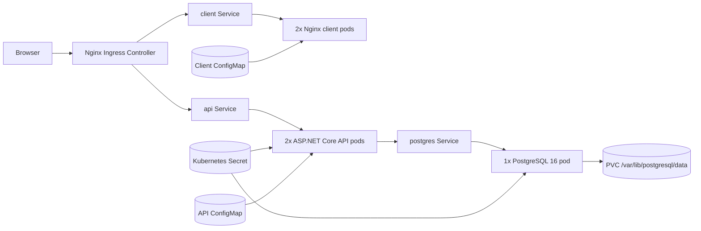

# Collega Kubernetes deployment plan

> ## ⚠️ THIS DESCRIBES INFRASTRUCTURE THAT DOES NOT EXIST YET
>
> **Nothing in this document is built.** It is a forward-looking plan, not a description of
> the current repository. Verified against `dev` on 2026-08-12 — the repository contains
> **no** `k8s/` directory, **no** Helm chart (`Chart.yaml`, `values.yaml`, `values.dev.yaml`,
> `values.prod.yaml`, `templates/`), **no** Kubernetes manifests of any kind (a repo-wide
> search finds zero YAML files containing `apiVersion:`), and **no** Dockerfiles anywhere.
>
> **Do not read any statement here as "already done."** Where this document says the chart
> "creates" a Service or the client image "comes from" a Dockerfile, read it as *would*,
> *once someone writes it*. Every path below (`k8s/…`, `src/Collega.API/Dockerfile`,
> `src/Collega.Client/Dockerfile`) is a **proposed** location for a file that is absent today.
>
> **Hard prerequisites, none of which are met:**
>
> | Prerequisite | Status |
> |---|---|
> | `src/Collega.API/Dockerfile` | Does not exist |
> | `src/Collega.Client/Dockerfile` | Does not exist |
> | Helm chart under `k8s/` | Does not exist |
> | Container images published to a registry | No registry, no build pipeline for images |
>
> Writing those artifacts is **out of scope for the current sprint**; this document
> deliberately stays a plan. Treat it as a design to review and cost, not a runbook to follow.
>
> *(This warning exists because a previous version of this document was written in the
> present and past tense — "the implementation uses a Helm chart under `k8s\`" — while
> describing a chart that had never been written, for a different project entirely. That
> phrasing caused a real planning error. Keep the tense honest when editing this file.)*

**Database engine:** this plan targets **PostgreSQL 16**, per the locked decision in
`SPEC/50-postgres-migration.md`. Earlier revisions described an in-cluster SQL Server 2022
pod; that is superseded and should not be reintroduced.

## Decision log

1. **Workload split:** Separate pods for the Blazor client, ASP.NET Core API, and PostgreSQL.
2. **Kubernetes environment:** Local development cluster (minikube, kind, or Docker Desktop Kubernetes).
3. **Blazor hosting:** Dedicated Nginx pod serving the published WebAssembly assets.
4. **External access:** Nginx Ingress Controller.
5. **PostgreSQL persistence:** PersistentVolumeClaim using the cluster default `StorageClass`.
6. **Resource organization:** Single namespace, `collega`.
7. **Replica count:** Start the API and client at 2 replicas each.
8. **Container image workflow:** CI/CD builds and pushes images; manifests reference image repository and tag placeholders.
9. **Environment strategy:** Helm chart with shared templates and environment-specific value overrides.

## Architecture



## Pod design

### Client pod

- Image source: `src/Collega.Client/Dockerfile` — **not written yet**
- Runtime: `nginx:alpine`
- Replicas: 2
- Purpose: Serve the Blazor WebAssembly static assets and SPA fallback routing
- Config inputs:
  - Nginx config from a `ConfigMap`
  - `appsettings.json` mounted from a `ConfigMap` with `ApiBaseUrl` set to `/`
- Health checks:
  - Liveness/readiness: TCP port 80

### API pod

- Image source: `src/Collega.API/Dockerfile` — **not written yet**
- Runtime: `mcr.microsoft.com/dotnet/aspnet:8.0`
- Replicas: 2
- Container port: 8080 (set `ASPNETCORE_URLS=http://+:8080`; the local `launchSettings.json` port is irrelevant in-container)
- Purpose: Serve ASP.NET Core API endpoints and Swagger
- Config inputs:
  - `ASPNETCORE_ENVIRONMENT`, `ASPNETCORE_URLS`, and `Swagger__Enabled` from a `ConfigMap`
  - `ConnectionStrings__DefaultConnection` from the PostgreSQL secret
  - `SiteAdmin__Email` and `SiteAdmin__Password` from a dedicated Site Admin secret (see `SPEC/20-feature-auth.md`)
- Health checks:
  - Liveness/readiness: `GET /api/v1/health` (the `api/v1` prefix is applied by `ApiVersionRoutePrefixConvention`)
- Startup note: the API runs EF Core `MigrateAsync` and idempotent seeding on boot, so the
  API pod must tolerate PostgreSQL being briefly unavailable. Prefer a generous
  `startupProbe` (or an init container that waits on the database) over a tight
  `livenessProbe` that would restart-loop the pod during first migration.

### PostgreSQL pod

- Image: `postgres:16`
- Runtime shape: single replica, `Recreate` strategy
- Container port: 5432
- Purpose: Local-cluster database for Collega
- Config inputs (from the PostgreSQL secret / values):
  - `POSTGRES_DB` — `Collega`
  - `POSTGRES_USER` — `collega` (Helm value; keep it aligned with `docker-compose.yml` so local
    and in-cluster development share one convention)
  - `POSTGRES_PASSWORD` — from the secret, never a literal in values
  - `PGDATA` — `/var/lib/postgresql/data/pgdata`
- Storage:
  - PVC mounted at `/var/lib/postgresql/data`
  - **`PGDATA` must point at a subdirectory of the mount**, as above. Many dynamic provisioners
    hand back a volume containing `lost+found`, and `initdb` refuses to initialize a non-empty
    directory. Pointing `PGDATA` one level down is the standard workaround.
- Health checks:
  - Readiness/liveness: `pg_isready` exec probe, e.g.
    `pg_isready -U "$POSTGRES_USER" -d "$POSTGRES_DB" -h 127.0.0.1`
  - `pg_isready` is dependency-free and ships in the image, so no extra tooling layer is needed.

## Networking and ingress

- All workloads live in the `collega` namespace.
- The chart would create three `ClusterIP` services:
  - `collega-client`
  - `collega-api`
  - `collega-postgres`
- The Nginx ingress exposes a single host: `collega.localdev.me` (lowercase — Kubernetes
  rejects uppercase characters in an ingress `host` field).
- Recommended route layout:
  - `/` -> client service
  - `/api` -> API service
  - `/playground` -> API service for Swagger UI
  - `/swagger` -> API service for the OpenAPI document
- The Blazor client is configured to call the API through the same host, so the deployed application stays same-origin and avoids extra CORS complexity.

## Persistence design

- PostgreSQL uses a `PersistentVolumeClaim` named `collega-postgres-data`.
- Access mode: `ReadWriteOnce`
- Default size: `20Gi`
- Storage class: cluster default, unless explicitly overridden in Helm values
- This is acceptable for local development. **For production, move the database to a managed
  service rather than keeping a stateful PostgreSQL pod inside the cluster** — `SPEC/50-azure-deployment.md`
  already targets Azure Database for PostgreSQL (Flexible Server, Burstable B1ms) and is the
  intended production path. A single-pod Postgres has no replication, no failover, and no
  point-in-time recovery; running one in production would mean hand-rolling all three.

## Secrets management

Never store secrets in source control. Any `k8s/secrets/postgres-secret.template.yaml` that
gets added should be a placeholder reference only, holding no real values.

Create the real secret directly in the cluster at deploy time:

```bash
kubectl create secret generic postgres-secret \
  --namespace collega \
  --from-literal=postgres-password='<POSTGRES_PASSWORD>' \
  --from-literal=connection-string='Host=collega-postgres;Port=5432;Database=Collega;Username=collega;Password=<POSTGRES_PASSWORD>'
```

The connection string is **Npgsql format** (`Host=…;Port=…;Database=…;Username=…;Password=…`),
matching `SPEC/50-postgres-migration.md`. It is consumed by the API as
`ConnectionStrings__DefaultConnection`.

Recommendations:

1. Use `kubectl create secret` or an external secrets manager for real deployments.
2. Do not create and commit `postgres-secret.yaml` or any file containing the actual password.
3. If production uses a managed PostgreSQL endpoint, keep the same secret name and change the
   `connection-string` literal to the managed host, appending `Ssl Mode=Require` (Azure Database
   for PostgreSQL requires TLS; see `SPEC/50-azure-deployment.md`).
4. The role in the connection string must be able to create and alter schema — the API runs
   EF Core migrations at startup.

## Resource limits and health recommendations

### Resource defaults

| Workload | Requests | Limits |
| --- | --- | --- |
| Client | `100m` CPU / `128Mi` memory | `250m` CPU / `256Mi` memory |
| API | `250m` CPU / `256Mi` memory | `500m` CPU / `512Mi` memory |
| PostgreSQL | `100m` CPU / `256Mi` memory | `500m` CPU / `1Gi` memory |

PostgreSQL's floor is substantially lower than the SQL Server figures this table previously
carried (`500m`/`1Gi` request, `1` CPU/`2Gi` limit). SQL Server will not start under 2 GB;
`postgres:16` runs comfortably in a few hundred MB at development data volumes. Revisit the
limit if the local dataset grows or if `shared_buffers` is tuned upward.

### Health checks

1. **API:** `GET /api/v1/health`
2. **Client:** TCP probe on port 80
3. **PostgreSQL:** `pg_isready` exec probe against `127.0.0.1`

### Deployment behavior

1. Use `RollingUpdate` for stateless workloads with `maxUnavailable: 0` and `maxSurge: 1`.
2. Use `imagePullPolicy: Always` in local/dev with mutable tags.
3. Use `imagePullPolicy: IfNotPresent` for stable, immutable tags or digests in production.

## Security and isolation

- A `NetworkPolicy` restricts PostgreSQL ingress on port 5432 to only pods labeled `tier=api` in the same namespace.
- The client pod has no direct path to the database.
- The API secret is limited to the database connection string it needs.
- Run the PostgreSQL container as a non-root user; the official image already runs as the
  `postgres` user, so set `fsGroup` on the pod `securityContext` to keep the PVC writable.
- Production deployments should replace the in-cluster PostgreSQL with a managed database and externalized secret management.

## Helm chart layout

The proposed chart would live under `k8s/` (**this directory does not exist**):

- `Chart.yaml`
- `values.yaml`
- `values.dev.yaml`
- `values.prod.yaml`
- `templates/`
- `secrets/`
- `README.md`

This keeps one set of templates while allowing local-dev and production-oriented value overrides.

## Deployment steps

These steps are **not runnable today** — they assume the Dockerfiles and the chart above have
been written first.

1. Ensure your local cluster is running and the Nginx Ingress Controller is installed.
2. Build and push the API and client images through CI/CD.
3. Create the `postgres-secret` in the target namespace using placeholder-based `kubectl create secret` commands at deploy time.
4. Review image repositories and tags in the Helm values files.
5. Install or upgrade the chart:

   ```bash
   helm upgrade --install collega ./k8s \
     --namespace collega \
     --create-namespace \
     -f ./k8s/values.dev.yaml
   ```

6. Verify pods, services, PVCs, and ingress.
7. Confirm the database came up before the API finished migrating:

   ```bash
   kubectl -n collega logs deploy/collega-api | tail -n 50
   kubectl -n collega exec deploy/collega-postgres -- pg_isready -U collega -d Collega
   ```

8. Browse to `http://collega.localdev.me/`.

## Known limitations

1. **The chart does not exist.** Everything above is a design, not a deliverable.
2. The chart, once written, would be optimized for a local development cluster, not a hardened production platform.
3. The PostgreSQL deployment is single-replica and uses a single PVC, so it provides no database HA, no streaming replication, and no automated backups.
4. Production ingress, TLS, cert-manager integration, monitoring, and autoscaling are not included in this first pass.
5. `values.prod.yaml` would raise baseline resources and pull policy expectations, but it should still be paired with a managed database strategy before real production use.
6. No backup/restore procedure is specified for the in-cluster PVC. Deleting the PVC destroys the database. This is tolerable only because local clusters hold nothing but disposable demo seed data.

## Best-practice recommendations

1. **Never store secrets in source control.**
2. **Use a managed PostgreSQL service for production workloads.**
3. **Keep liveness and readiness probes enabled for all three workloads.**
4. **Set both resource requests and limits on every workload.**
5. **Use zero-downtime rolling updates for API and client deployments.**
6. **Use `Always` for mutable dev tags and `IfNotPresent` for immutable production tags.**
7. **Keep the PostgreSQL `NetworkPolicy` in place so only API pods can connect.**
8. **Point `PGDATA` at a subdirectory of the PVC mount** so `initdb` is not defeated by `lost+found`.
