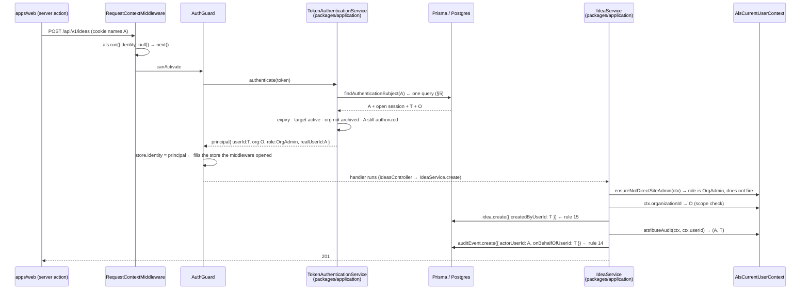

# 07 — Ambient identity in Nest and Next: findings

Answers `issues/07-viewas-ambient-identity.md`. Written 2026-09-04 against `dev`.
Unblocks `08` (auth/session model), which gates Wave 0.

**Status of this document.** It is a recommendation with worked code, not a decision.
The one thing it asks someone to *decide* is §3's recommendation; everything else follows
from it mechanically. The ticket's "resolve by" asked for a findings document with a
recommendation and a worked request path — §3 and §9 are those two things.

Versions named below were believed current when written. Pin every one from `npm view <pkg> version`
at adoption rather than copying a number out of this file.

---

## 1. The recommendation in one page

**Use `AsyncLocalStorage`, not Nest request-scoped providers.** Seed an empty mutable store in
an Express middleware, fill it in the auth guard, and expose it to `packages/application`
through a **singleton** provider implementing a `CurrentUserContext` port — the exact shape
`ICurrentUserContext` has today.

Three reasons, in order of weight:

1. **It is what the current system already does.** `HttpContextCurrentUserContext` is a
   singleton that reads `IHttpContextAccessor`, and `HttpContextAccessor` is implemented with
   `AsyncLocal<T>`. ALS is the direct port. Request-scoped DI is the novel mechanism, and this
   is a port.
2. **Request-scoped providers are structurally wrong here.** Scope bubbles up the whole
   injection chain in Nest. **14 of the 16 concrete Application services** take
   `ICurrentUserContext` today, and 14 of the 15 controllers depend on one of those, so marking
   the context request-scoped makes essentially the entire graph request-scoped — re-instantiated per request, on a
   platform where every request may also pay a cold start (constraint 14). §3.1 has the
   detail, including why Nest's "durable providers" escape hatch is the wrong tool for
   identity specifically.
3. **The mechanism would end up in the wrong layer.** Constraint 8's boundaries rule is
   `application` imports `domain` only, so `Scope.REQUEST` cannot appear in an Application
   service. It is still *reachable* — the module's `useFactory` in `apps/api` can be
   request-scoped, which is exactly how the contagion in reason 2 happens — so this is not a
   hard block, and §3.1 says so. What it means is that the lifetime rule protecting a property
   of `packages/application` would live entirely in `apps/api`, invisible from the code that
   depends on it. ALS keeps the port in Application and the plumbing in the API layer, which is
   where .NET already draws the line.

**What follows from it, and is not optional:**

| | |
|---|---|
| The store is **seeded in middleware, filled in the guard** | A guard cannot wrap the handler in `als.run()` — the handler executes after `canActivate` returns. §3.3. |
| The context provider is a **singleton with lazy getters** | Never snapshot identity into a field. A singleton constructed once would serve one user's identity to every request forever. |
| **No ambient store throws; anonymous is null** | Two different conditions. Background work with no store must fail loudly, because `role === null` makes `ensureNotDirectSiteAdmin` *pass* — over-permission, the failure direction the ticket names. §11. |
| The chokepoint is **lint-enforced, not documented** | Three cheap layers plus one custom rule. §7. Documentation did not prevent this class of bug before. |
| Identity is **resolved inside Nest, per request, from the database** | Whatever `08` chooses, the credential names only the *real* user. §6.4. |

---

## 2. What the .NET system does, so you need not open the C#

Five facts. Everything in this document is downstream of them.

1. **The access token names only the real user, and is never reissued.** Impersonation is a
   database row (`impersonation_sessions`), not a claim. A captured token carries no
   impersonation authority. (`20-feature-view-as.md` rule 1;
   `src/Collega.Domain/Impersonation/ImpersonationSession.cs`.)

2. **The session is resolved on every request, at the one place identity is already
   established.** `TokenAuthenticationService.AuthenticateAsync` validates the token, re-reads
   the user from the database (status, security stamp), then looks for an open session for
   that real user and, if one is live, re-checks *five* things before honouring it: absolute
   expiry, idle expiry, target still `Active`, target's organization not archived, and the
   real user *still* satisfies the rule 8 matrix (an admin demoted mid-session loses the
   session at the next request, because nothing rotates their security stamp). Then it
   returns a principal whose every identity field is the **target's**, with the real actor
   carried alongside.

3. **`ICurrentUserContext` is the single chokepoint.** During a live session it reports the
   target's `UserId`, `OrganizationId` and `Role`; `IsImpersonating` is true and `RealUserId`
   is the administrator. Every org-scoping and role check downstream therefore applies to the
   target with **no per-service special-casing**. Verified 2026-08-13: on the server,
   nothing outside `src/Collega.API/Authentication/` reads `HttpContext.User`, `ClaimTypes` or
   `FindFirstValue` — re-verified while writing this document, still exactly those four files.
   The **Blazor client** holds the one other reader,
   `Collega.Client/Auth/CollegaAuthStateProvider.cs`. That is not an exception to the chokepoint
   but the client-side twin §6.3 is about: it builds a principal from a stored summary, which is
   precisely what an httpOnly cookie removes.

4. **One guard covers both paths because of fact 3.** `OrgContentMutationGuard.EnsureNotDirectSiteAdmin`
   throws when `Role == SiteAdmin`. During impersonation `Role` is the *target's*, so it
   simply does not fire. That is the whole mechanism: the same guard blocks a Site Admin
   acting directly and permits the identical call made through View As. 15 call sites across
   7 services.

5. **Dual attribution is a pure function of the context.** `AuditAttributionExtensions.AttributeAudit`
   maps the actor a service *intends* to record onto the `(ActorUserId, OnBehalfOfUserId)` pair
   that gets persisted: when impersonating **and** the intended actor is the acting identity,
   the real admin becomes the actor and the target moves to `OnBehalfOfUserId`. The condition
   matters — login-failure events name an account that is not the caller and must pass through
   untouched.

Two things that are *not* facts 1–5 but that the port must keep:

- **Entity authorship is the target** (`CreatedByUserId`/`UpdatedByUserId`), while **audit
  actorship is the real admin**. Rule 15 and rule 14 point in opposite directions deliberately.
- **`ViewAsService` is the one place that must not use the acting identity.** It authorizes
  against `RealUserId`, re-read from the database, because asking the impersonated user whether
  they may impersonate is the wrong question. This is the single exception to the chokepoint
  rule and it is already load-bearing for rule 5 (non-nestable).

---

## 3. `AsyncLocalStorage` vs request-scoped providers

### 3.1 Why request-scoped providers lose

**Scope contagion.** Nest propagates scope *up* the injection chain: a provider that injects a
request-scoped provider becomes request-scoped, and so does its consumer, transitively to the
controller. Measured against the current tree:

```
$ grep -rln ICurrentUserContext src/Collega.Application --include=*.cs | wc -l
18        # of which 3 are Abstractions/ (the port + two static helpers) and 1 is IAuthService

Concrete services: 14
  AiPromptService · AiUsageService · IdeaAssistService · AuthService · BoardService
  CommentService · FieldDefinitionService · IdeaFieldService · IdeaService
  OrganizationService · StatusService · TagService · UserService · ViewAsService
```

That is 14 of the **16** concrete services in the layer (30 is the file count — 16
implementations plus 14 interfaces — and is the wrong denominator), and 14 of the 15 controllers
reach them. `HealthController` is the exception at both ends: it injects nothing, deliberately,
so a liveness probe answers even when the database does not. So "make the context
request-scoped" is not a local decision about one provider; it converts the whole
application graph to per-request instantiation. Concretely that means, on every request:
a fresh DI sub-tree walk, fresh instances of those 14 services and everything *they* inject
(repositories, the Prisma client wrapper, the clock, the audit writer), and — if
`APP_GUARD`/`APP_INTERCEPTOR` end up in the chain — request-scoped enhancers too, which lose
singleton lifecycle hooks.

**Serverless compounds it** (constraint 14). A Vercel function container bootstraps Nest on a
cold start and then serves many invocations warm. Request-scoped DI moves work *out* of the
one-time bootstrap and *into* every invocation, which is precisely the wrong direction on a
platform where the warm path is the only path you can optimise. It also gains nothing:
per-request isolation is not a benefit when the alternative is a single store keyed by the
async context.

**Durable providers are not the escape hatch.** Nest's answer to request-scope cost is durable
providers with a `ContextIdStrategy` — sub-trees cached and keyed by, typically, a tenant id.
That is a cache keyed on something identity-shaped, which for this feature is exactly the bug:
a Site Admin impersonating a user in org X and then, after exiting, acting as themselves would
share a cached sub-tree with the earlier identity if the key were organization-derived. Do not
reach for it.

**It cannot cross the layer boundary anyway.** `Scope.REQUEST` is `@nestjs/common`. Application
services are plain classes wired by `useFactory` from `apps/api/src/<feature>/<feature>.module.ts`,
because constraint 8 forbids `packages/application` from importing Nest. You could still
make the *factory* request-scoped via `inject:` — which is how the contagion above happens —
but the mechanism would live entirely in `apps/api` while the property it protects lives in
`packages/application`. ALS keeps the port in Application and the plumbing in the API layer,
which is where the .NET version already draws the line (`HttpContextCurrentUserContext` lives in
`Collega.API` "per the layering rules in CLAUDE.md").

**Testability.** A request-scoped provider must be resolved through `ModuleRef.resolve()` with a
`ContextId`, so a unit test of `IdeaService` needs a Nest testing module. Under ALS, `IdeaService`
takes a `CurrentUserContext` in its constructor and a test passes an object literal:

```ts
const ctx: CurrentUserContext = {
  isAuthenticated: true, userId: TARGET, organizationId: ORG,
  role: Role.User, isImpersonating: true, realUserId: ADMIN,
};
new IdeaService(ctx, repos, clock, audit, uow);
```

No Nest at all in `packages/application` tests. This matters more than it looks: ticket `10`
discarded the .NET suite, so every Application test is being rewritten by a QA agent in Wave B,
and Wave B has not yet built `apps/api`. Under request-scoped providers, Wave B's tests would
need the Nest runtime that Wave D produces.

### 3.2 What ALS costs, and where it actually breaks

**Async boundaries.** ALS propagates through `await`, promise chains, `setTimeout`,
`queueMicrotask`, and anything Node's async-resource tracking sees — which is all normal
Nest/Prisma code. It is lost in exactly these places:

| Loses context | Why | Mitigation |
|---|---|---|
| A callback registered on an `EventEmitter` **outside** the `run()` | The listener's async root predates the store | `AsyncResource.bind(fn)` at registration, or don't |
| `worker_threads` | Separate isolate | Pass identity explicitly as a message |
| A new async root — cron handler, queue consumer, a script | Nothing ran `als.run()` | §11: explicit `runAs()` |
| Anything after the invocation is torn down | Serverless, not ALS | §10 |

Not lost: Prisma queries, interactive transactions, `Promise.all`, nested awaits, thrown-and-caught
errors, `finally` blocks, `res.on('finish')` handlers registered inside the request.

**Performance.** Historically ALS carried a real cost through `async_hooks`; the modern
implementation (`AsyncContextFrame`, believed default-on in Node 24) is a pointer copy per async
resource. Against a request that makes at least one Prisma round trip over a pooled connection,
this should be unmeasurable. **I have not measured it** — see §12, uncertainty 1, for the recipe.
The honest position: the cost is very likely irrelevant, and if it is not, request-scoped
providers are strictly worse on the same axis.

**The real cost is discipline, and it is small:** exactly one file may call
`requestContextStorage.getStore()`. That is enforceable (§7).

### 3.3 The Nest wiring detail that is easy to get wrong

Nest's pipeline order is **middleware → guards → interceptors → pipes → handler**.

- A **guard** cannot open the store, because `canActivate` returns before the handler runs;
  anything you `als.run()` inside it has already exited by then.
- An **interceptor** *can* wrap the handler (`return als.run(store, () => next.handle())`) —
  but interceptors run *after* guards, so the guard that resolved identity had nowhere to put it.

The resolution, which is also Nest's own documented ALS recipe:

> **Middleware seeds an empty, mutable store. The guard fills it.**

```ts
// apps/api/src/common/request-context/request-context.middleware.ts
@Injectable()
export class RequestContextMiddleware implements NestMiddleware {
  use(_req: Request, _res: Response, next: NextFunction) {
    // Empty and mutable on purpose: the auth guard runs later, inside this call,
    // and writes `identity` into this same object.
    requestContextStorage.run({ identity: null, requestId: randomUUID() }, () => next());
  }
}
```

Registered once in `apps/api/src/app.module.ts`
(`configure(consumer) { consumer.apply(RequestContextMiddleware).forRoutes('*path') }`).
**`'*path'`, not `'*'`** — Nest 11 runs Express 5 and path-to-regexp v8, where a bare wildcard
throws at boot. Every request must pass through this, so getting it wrong fails loudly, but it
fails as a routing error rather than as anything to do with identity.
`app.module.ts` is a contended artifact owned by Foundation — which is fine, because this is S0.3
work, and S0.3 already exists to own "the `AsyncLocalStorage` request context that View As will
need" (`SPEC/50-typescript-migration.md` §5, Wave 0).

### 3.4 Library: hand-roll it

**Recommendation: hand-roll.** The whole mechanism is four small files (§4) and about 90 lines
including types. `nestjs-cls` (v4/v5 line) wraps the same thing with a module, decorators, a
proxy-provider system and a Prisma transaction plugin. Its cost is a dependency on the seam that
every request in the product passes through, plus a second vocabulary (`ClsService`, `@UseCls`)
layered over the port that `packages/application` already defines. Its benefit — the
`@nestjs/cls` transactional plugin — belongs to slice C1's unit-of-work question, not to identity.

**Switch to `nestjs-cls` if** the hand-rolled module exceeds ~120 lines, or if C1 decides to carry
the Prisma transaction handle in the same store (§12, uncertainty 4). Both are cheap to detect and
the migration is mechanical.

---

## 4. The Nest side, in code

Four files in `apps/api/src/common/request-context/` (S0.3), plus one port in
`packages/application/src/common/` (also S0.3).

### 4.1 The port — `packages/application/src/common/current-user-context.ts`

A faithful port of `ICurrentUserContext`. Nullable properties are kept deliberately: an
anonymous request is legitimate (`POST /auth/login`), and `AuthService` writes login-failure
audit events with no authenticated context.

```ts
import type { Role } from '@collega/domain/enums';

/**
 * The identity the current request acts under. This is the SINGLE chokepoint for
 * "who is calling" on the API side: nothing outside apps/api/src/auth/ and the token
 * adapter reads a credential, which is what lets View As work without touching any
 * authorization code (SPEC/20-feature-view-as.md rules 4/4a). apps/web has its own,
 * separate chokepoint in lib/server/current-user.ts, which holds a credential but
 * decides nothing — see findings 07 §6.
 *
 * Reading credentials elsewhere silently opts that code out of impersonation.
 * `collega/no-ambient-identity-read` makes that a lint error, not a convention.
 */
export interface CurrentUserContext {
  readonly isAuthenticated: boolean;

  /** The ACTING user. While a View As session is live this is the impersonated user. */
  readonly userId: string | null;

  readonly organizationId: string | null;
  readonly role: Role | null;

  /** True while acting as someone else. */
  readonly isImpersonating: boolean;

  /** The real administrator. Equals `userId` when not impersonating — never null when authenticated. */
  readonly realUserId: string | null;
}
```

### 4.2 The store — `apps/api/src/common/request-context/request-context.ts`

```ts
import { AsyncLocalStorage } from 'node:async_hooks';
import type { Role } from '@collega/domain/enums';

/** Already-resolved effective identity. `role` is the TARGET's role during impersonation. */
export interface ResolvedIdentity {
  readonly userId: string;
  readonly organizationId: string | null;
  readonly role: Role;
  readonly isImpersonating: boolean;
  readonly realUserId: string;
}

export interface RequestContext {
  identity: ResolvedIdentity | null;
  readonly requestId: string;
}

/** The ONLY module permitted to construct or read this. See eslint.config.js. */
export const requestContextStorage = new AsyncLocalStorage<RequestContext>();

export class NoAmbientIdentityError extends Error {
  constructor() {
    super(
      'No request context. Identity is only ambient inside an HTTP request. ' +
      'Background work must supply one explicitly via runAs().',
    );
  }
}
```

### 4.3 The adapter — `als-current-user-context.ts`

The direct analogue of `HttpContextCurrentUserContext`. **Singleton, lazy getters.**

```ts
@Injectable()   // Scope.DEFAULT. Never Scope.REQUEST — see findings 07 §3.1.
export class AlsCurrentUserContext implements CurrentUserContext {
  private get store(): RequestContext {
    const store = requestContextStorage.getStore();
    // Absent store and anonymous request are DIFFERENT conditions.
    // Absent store is a bug (or unguarded background work) and must fail loudly:
    // returning nulls would let `ensureNotDirectSiteAdmin` pass. See §11.
    if (!store) throw new NoAmbientIdentityError();
    return store;
  }

  get isAuthenticated(): boolean { return this.store.identity !== null; }
  get userId(): string | null { return this.store.identity?.userId ?? null; }
  get organizationId(): string | null { return this.store.identity?.organizationId ?? null; }
  get role(): Role | null { return this.store.identity?.role ?? null; }
  get isImpersonating(): boolean { return this.store.identity?.isImpersonating ?? false; }
  get realUserId(): string | null { return this.store.identity?.realUserId ?? null; }
}
```

Every property is a getter over the live store. There is no field to go stale, which is what
makes the singleton safe — and is why a constructor that did
`this.role = store.identity.role` would serve the first request's role to every subsequent
request in that warm container, forever. That is the serverless-shaped version of the Sprint 6.5
client bug, and it belongs in the module's doc comment.

### 4.4 Escape hatch for non-request work — `run-as.ts`

```ts
export function runAs<T>(identity: ResolvedIdentity | null, fn: () => T): T {
  return requestContextStorage.run({ identity, requestId: randomUUID() }, fn);
}

/**
 * For scheduled/queued work that legitimately has no human actor.
 * userId null means audit rows record actorUserId = null, which the schema already allows.
 */
export const SYSTEM_IDENTITY = null;
```

---

## 5. Auth resolution: one query, not four

The .NET path issues up to four sequential reads per authenticated request while impersonating
(user, open session, target, target's organization), plus an occasional `LastSeenAt` write.
On a long-lived host with a warm pool that was cheap. On Vercel + Prisma Postgres every one is a
pooled network round trip on a function that may itself be cold. **Collapse it into one query**
behind a single repository method:

```ts
// packages/infrastructure/src/repositories/authentication-subject.repository.ts
findAuthenticationSubject(userId: string) {
  return this.prisma.user.findUnique({
    where: { id: userId },
    select: {
      id: true, status: true, securityStamp: true, role: true, organizationId: true,
      mustChangePassword: true, firstName: true, lastName: true, email: true,
      impersonationSessionsAsRealUser: {
        where: { endedAtUtc: null },
        // `take: 1` is only deterministic while ux_impersonation_sessions_real_user_id_open
        // exists — and `05` measured that introspection DROPS it. Until S0.2 re-adds it as raw
        // SQL, two open rows are possible and this silently picks one. The orderBy is the belt.
        orderBy: { startedAtUtc: 'desc' },
        take: 1,
        select: {
          id: true, startedAtUtc: true, lastSeenAtUtc: true, absoluteExpiresAtUtc: true,
          targetUser: {
            select: {
              id: true, role: true, status: true, organizationId: true,
              firstName: true, lastName: true, email: true,
              organization: { select: { id: true, isArchived: true } },
            },
          },
        },
      },
    },
  });
}
```

`TokenAuthenticationService` (ported to `packages/application/src/auth/token-authentication.service.ts`)
then applies the same five checks against that one result, unchanged in logic. The idle-refresh
write stays throttled exactly as it is today — once per quarter of the idle window, not per
request. That throttle is not a micro-optimisation; without it every authenticated GET during a
session becomes a committed write, which on serverless is a round trip plus a transaction.

**Do not cache the result.** Not in module scope, not in an LRU keyed by token. Fact 2 exists
because deactivation, demotion and expiry must take effect at the *next* request. A cache here is
the over-permission failure with a TTL on it.

---

## 6. The Next.js side

### 6.1 The short version

Constraint 11 makes this simpler than the ticket's framing suggests. **Next has no ambient
identity of its own that authorizes anything.** It is a client. Its "identity" exists for two
purposes only: deciding what to render, and forwarding a credential. Every authorization
decision happens inside Nest, on the identity resolved in §5.

So the Next-side question is not "how does ambient identity work" — it is "where does the
credential live, and how does the rendered identity stay honest". Those have crisp answers.

### 6.2 The request-context stories, precisely

| Surface | Request context | Can read `cookies()` | Can *write* cookies | Verdict |
|---|---|---|---|---|
| **Server Component** (`page.tsx`, `layout.tsx`) | Next's own ALS-backed request store | Yes (`await cookies()` from `next/headers`, async since Next 15) | **No** | Renders from `/auth/me`. Never decides authorization. |
| **Route Handler** (`app/api/**/route.ts`) | Full `Request` | Yes | Yes | Only needed for BFF-shaped work. Under constraint 11 most calls go straight to Nest. |
| **Server Action** | Same store as route handlers | Yes | Yes | The write path — login, View As start/exit, and anything that must set or clear a cookie. |
| **Client Component** | none | No | No (except non-httpOnly, which we do not use) | Has no identity. Calls a server action or Nest directly. |
| **Middleware** (`middleware.ts`) | Edge runtime | Yes | Yes | Redirects only. **Never an authorization decision** — same status as the View As UI control under rule 8: a convenience carrying no authority. |

**Where the token lives: an httpOnly, `Secure`, `SameSite=Lax` cookie.** Not `localStorage`, not
a JS-readable cookie, not a React context. Two reasons: server components can only read cookies
and headers, so a browser-storage token is invisible to the surface that does most of the
rendering; and an httpOnly cookie is unreadable by client JS, which structurally removes the
Sprint 6.5 bug class (§6.3).

### 6.3 The client-side twin, and its worse Next-specific version

Sprint 6.5's finding: the Blazor client built a `ClaimsPrincipal` from a stored user summary,
so during impersonation every `[Authorize(Roles=…)]` surface kept rendering for the real
administrator until `MainLayout.ReloadIdentityAsync` was made to push `/auth/me`'s answer back
into the principal.

In Next, this bug has two forms, and the second is worse:

**Form 1 — the direct port.** A `useUser()` context populated once at sign-in and never
refreshed. Structurally impossible if the token is httpOnly: the client cannot decode a
principal it never holds, and there is nothing to cache. This is the strongest single argument
`07` can hand `08` (see §6.4).

**Form 2 — Next's own caching, and it is new.** `unstable_cache`, `fetch(..., { cache: 'force-cache' })`,
a route segment's `export const revalidate`, or `export const dynamic = 'force-static'` will
cache an identity-bearing response **across users**, not merely across time. That is not
"renders for the real administrator" — it is "renders one tenant's data to another". The rule:

> **Any fetch that carries a credential is `cache: 'no-store'`.** No exceptions, no `revalidate`,
> no `unstable_cache`. De-duplicate *within* one render pass with React `cache()`, which is
> per-request by construction; never across requests.

Both halves land in one file, which is the Next-side chokepoint:

```ts
// apps/web/lib/server/current-user.ts
import { cookies } from 'next/headers';          // the ONLY file allowed to import this
import { cache } from 'react';

export const getCurrentUser = cache(async (): Promise<Me | null> => {
  const token = (await cookies()).get(SESSION_COOKIE)?.value;
  if (!token) return null;

  const res = await fetch(`${env.API_BASE_URL}/api/v1/auth/me`, {
    headers: { cookie: `${SESSION_COOKIE}=${token}` },
    cache: 'no-store',                            // never anything else
  });
  if (!res.ok) return null;

  // `me` describes the IMPERSONATED user while a session is live, and carries `viewingAs`
  // when one is. Every role-gated surface must read this, not a remembered value.
  return (await res.json()) as Me;
});
```

`react`'s `cache()` memoises for the duration of a single server render, so a layout, a page and
four components share one `/auth/me` call and none of them can see a stale one. That is exactly
the property `ReloadIdentityAsync` had to be taught by hand.

The banner (rule 22), the rail avatar (rule 23) and whether the `View as…` control is offered all
come from `getCurrentUser()` — never from remembered local state — which is what stops a session
that expired server-side from leaving a stale banner on screen.

### 6.4 What `07` constrains for `08` — read this before answering `08`

`08` picks between (A) client-held bearer token, (B) httpOnly cookie terminated at Next with a
forwarded identity, (C) Nest issues cookies directly. **The Nest-side design in §3–§5 is
identical under all three.** Only the guard's first three lines change — read an `Authorization`
header, read a cookie, or read a forwarded assertion. `08` is therefore genuinely free.

With two constraints that `07` does impose, and one input:

1. **The credential must name only the real user.** The effective identity is derived inside
   Nest, per request, from `impersonation_sessions`. This is rule 1 and it is not negotiable —
   it is what makes a captured credential carry no impersonation authority, and what makes idle
   expiry, central revocation and non-nestability enforceable at all.

2. **Option B is the one that can fail constraint 1 by accident.** If Next terminates the session
   and forwards *who the user is*, the temptation is to forward the effective identity — Next
   already called `/auth/me` and knows the target. Doing that makes Next the impersonation
   authority, and Next is a client from the API's perspective. It breaks rule 7 (server-authoritative;
   the client cannot forge or extend a session) and it means a bug in `apps/web` becomes a
   privilege-escalation bug. If `08` picks B, the forwarded thing must be a credential for the
   **real** user — a short-lived signed assertion naming `realUserId` and nothing else — and
   Nest must still do the §5 resolution. Write that into the decision, not into a comment.

3. **Input, not a decision: B and C are better than A on `07`'s grounds.** Both make an
   httpOnly cookie the credential, so the client never holds a decodable token and the Sprint 6.5
   bug class becomes structurally impossible rather than merely disciplined (§6.3, form 1). A
   also ports the temptation intact: a JWT in client JS invites decode-and-cache, and the last
   time that happened it cost a sprint to find. `08` owns the trade-off against C's cross-origin
   cost; this is one weight on the scale.

---

## 7. Mechanical enforcement of the chokepoint

The ticket's framing is right: documentation did not prevent this class of bug. Four layers,
cheapest first. Layers 1–2 are configuration. Layer 3 is ~70 lines. Layer 4 is ~15.

### 7.1 Layer 1 — `eslint-plugin-boundaries` (already adopted, constraint 8)

Add `auth` and `request-context` as element types so the layer rules already being written can
carry the identity rule too, rather than it being a separate mechanism:

```js
// eslint.config.js  (owned by S0.1)
settings: {
  'boundaries/elements': [
    { type: 'domain',          pattern: 'packages/domain/src/*' },
    { type: 'application',     pattern: 'packages/application/src/*' },
    { type: 'infrastructure',  pattern: 'packages/infrastructure/src/*' },
    { type: 'api-auth',        pattern: 'apps/api/src/auth/*' },
    { type: 'request-context', pattern: 'apps/api/src/common/request-context/*' },
    { type: 'api',             pattern: 'apps/api/src/*' },
    { type: 'web-server',      pattern: 'apps/web/lib/server/*' },
    { type: 'web',             pattern: 'apps/web/*' },
  ],
},
```

with an `boundaries/element-types` rule allowing `request-context` to be imported only by
`api-auth` and `api` module wiring — so a feature service importing `requestContextStorage`
is a lint error on the same run that catches a layer violation.

### 7.2 Layer 2 — `no-restricted-imports` zones (zero custom code)

Catches the import-shaped half outright:

```js
{
  files: ['**/*.ts', '**/*.tsx'],
  ignores: [
    'apps/api/src/auth/**',
    'apps/api/src/common/request-context/**',
    // The token adapter, not the token *policy*. TokenAuthenticationService stays in
    // packages/application and decides; this file only signs and verifies, exactly as
    // Infrastructure/Security/JwtAccessTokenService.cs implements IAccessTokenValidator today.
    'packages/infrastructure/src/security/jwt-access-token.service.ts',
    'apps/web/lib/server/current-user.ts',
    'apps/web/lib/server/api-client.ts',
  ],
  rules: {
    'no-restricted-imports': ['error', { paths: [
      { name: 'jsonwebtoken', message: 'Tokens are read only in apps/api/src/auth/. Use CurrentUserContext.' },
      { name: 'jose',         message: 'Tokens are read only in apps/api/src/auth/. Use CurrentUserContext.' },
      { name: '@nestjs/jwt',  message: 'Tokens are read only in apps/api/src/auth/. Use CurrentUserContext.' },
      { name: 'next/headers', message: 'Read cookies/headers only in apps/web/lib/server/. Use getCurrentUser().' },
      { name: 'node:async_hooks', message: 'The request store lives in apps/api/src/common/request-context/.' },
    ]}],
  },
}
```

The allowlist is the `ignores` array — one visible list, in one file, that a reviewer can read.
That list is the TypeScript expression of Sprint 6 Slice 0's audit result.

### 7.3 Layer 3 — the custom rule `collega/no-ambient-identity-read`

Imports are not the whole surface. `req.user`, `ctx.switchToHttp().getRequest().user` and
`request.headers.authorization` involve no import at all. Sketch, complete enough to implement:

```js
// tools/eslint-plugin-collega/src/rules/no-ambient-identity-read.js
const REQUEST_ID   = /^(req|request|httpRequest|rawRequest)$/;
const IDENTITY_KEY = /^(user|claims|principal|jwt|identity|auth)$/;

/** @type {import('eslint').Rule.RuleModule} */
export default {
  meta: {
    type: 'problem',
    docs: {
      description:
        'Identity may only be read through CurrentUserContext. A direct read silently ' +
        'opts the caller out of View As (SPEC/20-feature-view-as.md rule 4a).',
    },
    schema: [],
    messages: {
      requestIdentity:
        "Do not read '{{ name }}' off the request. Inject CurrentUserContext instead — a direct " +
        'read authorizes as the real administrator while the rest of the request acts as the target.',
      switchToHttp:
        'Do not reach for the raw request. Identity comes from CurrentUserContext; ' +
        'everything else belongs in a DTO or a @Param/@Query decorator.',
      authorizationHeader:
        'The Authorization header is read only in apps/api/src/auth/.',
      jwtCall:
        'Token verification/decoding happens only in the token adapter ' +
        '(packages/infrastructure/src/security/). Everywhere else, ask CurrentUserContext.',
    },
  },

  create(context) {
    return {
      // req.user / request.claims / httpRequest.principal
      'MemberExpression[computed=false]'(node) {
        if (node.object.type !== 'Identifier') return;
        if (!REQUEST_ID.test(node.object.name)) return;
        if (node.property.type !== 'Identifier') return;
        if (!IDENTITY_KEY.test(node.property.name)) return;
        context.report({ node, messageId: 'requestIdentity', data: { name: node.property.name } });
      },

      // req.headers['authorization'] / req.headers.authorization
      'MemberExpression[object.property.name="headers"]'(node) {
        const key = node.computed
          ? (node.property.type === 'Literal' ? String(node.property.value) : '')
          : (node.property.type === 'Identifier' ? node.property.name : '');
        if (key.toLowerCase() === 'authorization' || key.toLowerCase() === 'cookie') {
          context.report({ node, messageId: 'authorizationHeader' });
        }
      },

      // ctx.switchToHttp().getRequest()
      'CallExpression[callee.property.name="getRequest"]'(node) {
        context.report({ node, messageId: 'switchToHttp' });
      },

      // jwt.verify(...) / jwt.decode(...) / decodeJwt(...) / jwtVerify(...)
      'CallExpression'(node) {
        const c = node.callee;
        const name =
          c.type === 'Identifier' ? c.name
          : c.type === 'MemberExpression' && c.property.type === 'Identifier' ? c.property.name
          : '';
        if (/^(verify|decode|jwtVerify|decodeJwt)$/.test(name)) {
          context.report({ node, messageId: 'jwtCall' });
        }
      },
    };
  },
};
```

Scoped by the same `ignores` allowlist as layer 2. Two notes for whoever implements it:

- The `verify|decode` selector will produce false positives (`schema.decode`, `zod.parse`-adjacent
  helpers). Either narrow it to a member expression whose object is `jwt`/`jose`, or accept the
  noise and let the four allowlisted files be the only place it fires. Start narrow; widen on
  the first miss.
- **Packaging:** `tools/eslint-plugin-collega/`, added to `pnpm-workspace.yaml`'s globs, alongside
  `tools/golden/`. Owned by S0.1. Under ESLint 9 flat config the *plugin* is a plain object —
  `{ rules: { 'no-ambient-identity-read': rule } }` — registered in `eslint.config.js` under the
  `collega` key, which is what makes `collega/no-ambient-identity-read` resolve. The file sketched
  above is the rule, not the plugin. No `eslint-plugin-*` resolution magic and no separate CI step
  (constraint 8 wants it in the same lint run).

### 7.4 Layer 4 — one architecture test, as the belt

Lint can be disabled inline. One Vitest file makes the allowlist itself the assertion, which is
Sprint 6 Slice 0's manual audit turned into something that runs:

```ts
// tools/arch/identity-chokepoint.test.ts
// `requestContextStorage\.` rather than `getStore\(\)`: run-as.ts calls .run(), not .getStore(),
// and an exact-equality assertion listing a file the regex cannot match fails on the first run.
const IDENTITY_READ = /\b(req|request)\.(user|claims|principal)\b|requestContextStorage\.|from ['"]next\/headers['"]|from ['"](jsonwebtoken|jose|@nestjs\/jwt)['"]/;

it('only the authentication chokepoint reads identity directly', async () => {
  const offenders = (await sourceFiles(['apps/**', 'packages/**']))
    .filter((f) => IDENTITY_READ.test(readFileSync(f, 'utf8')))
    .sort();

  expect(offenders).toEqual([
    'apps/api/src/auth/auth.guard.ts',
    'apps/api/src/common/request-context/als-current-user-context.ts',
    'apps/api/src/common/request-context/request-context.middleware.ts',
    'apps/api/src/common/request-context/run-as.ts',
    'apps/web/lib/server/current-user.ts',
    'packages/infrastructure/src/security/jwt-access-token.service.ts',
  ]);
});
```

An exact-equality assertion, not a `not.toContain`. Adding a legitimate reader is then a
deliberate one-line diff a reviewer sees, which is the behaviour we want.

### 7.5 Layer 5 — make dual attribution unforgettable at the type level

Lint stops the wrong *read*. Nothing above stops a service constructing an audit row with a raw
actor id and skipping the attribution helper. A branded type does, at zero runtime cost:

```ts
// packages/application/src/common/audit-attribution.ts

// EXPORTED on purpose: an un-exported `unique symbol` in a type that crosses a package
// boundary breaks `declaration: true` emit (TS4023), which this workspace uses.
export declare const brand: unique symbol;

export type Attribution = {
  readonly actorUserId: string | null;
  readonly onBehalfOfUserId: string | null;
  readonly [brand]: 'attributed';
};

/** The only producer. Not exported from the package index — `attributeAudit` is the public door. */
const brandAttribution = (
  actorUserId: string | null,
  onBehalfOfUserId: string | null,
): Attribution => ({ actorUserId, onBehalfOfUserId }) as Attribution;
```

`AuditEvent.create` takes an `Attribution`, and `attributeAudit()` is the only exported function
that produces one. This is the only place in the design where the type system rather than lint
does the work, and it is worth it because the dual-attribution failure is silent and permanent —
a wrong audit row is not detectable after the fact.

**Stated honestly, because §7.4 states the same thing about lint:** this is a speed bump, not a
barrier. `{ actorUserId, onBehalfOfUserId } as Attribution` compiles, exactly as
`brandAttribution` itself relies on. What the brand buys is that skipping attribution requires a
deliberate cast, which a reviewer sees in the diff — the same standard as the architecture test,
and the same reason.

---

## 8. Dual attribution

Direct port of `AuditAttributionExtensions`, as a pure function of the context. It belongs in
`packages/application`, not in infrastructure.

```ts
// packages/application/src/common/audit-attribution.ts

/**
 * Maps the actor a service INTENDS to record onto the (actor, on-behalf-of) pair that is
 * persisted, so rule 14 holds at every audit site rather than only inside ViewAsService.
 *
 * While a session is live, currentUser.userId is the IMPERSONATED user — that is what makes
 * authorization apply to them (rule 4). Recording it as the audit actor would say the target
 * did this to themselves, which is exactly the accountability failure rule 14 prevents.
 *
 * The rewrite is deliberately conditional on `intendedActorUserId` matching the acting identity.
 * Some audit events name someone other than the caller, or no one — AuthService's login-failure
 * events record the account being attempted and run before any authenticated context exists.
 * Those pass through untouched.
 */
export function attributeAudit(
  currentUser: CurrentUserContext,
  intendedActorUserId: string | null,
): Attribution {
  if (
    currentUser.isImpersonating &&
    intendedActorUserId !== null &&
    intendedActorUserId === currentUser.userId
  ) {
    return brandAttribution(currentUser.realUserId, currentUser.userId);
  }
  return brandAttribution(intendedActorUserId, null);
}
```

**Where the audit write picks it up: in the Application service, at the point it builds the
event.** All 13 audit sites already look like
`AuditEvent.Create(..., attribution.ActorUserId, ..., attribution.OnBehalfOfUserId)`, so the port
is mechanical.

**Rejected: a Prisma client extension that stamps audit rows from ALS automatically.** It is
tempting — it would make the pair impossible to forget, which is what §7.5 is straining to
achieve. It fails on the conditional case: login failures and administrative actions that name a
third party would be silently rewritten to name the caller, and the resulting audit trail would
be wrong in a way nothing detects. It also puts `packages/infrastructure` in the business of
reading identity, which reopens the chokepoint the lint rules just closed. Keep it in Application;
enforce it with the type.

**The other half of attribution, which is not this function:** entity authorship
(`createdByUserId` / `updatedByUserId`) records the **target**, i.e. plain `currentUser.userId`,
because content created through View As genuinely belongs to that organization (rule 15). Rule 14
and rule 15 point in opposite directions on purpose. Any helper that "fixes" authorship to the
real admin is a bug.

---

## 9. `OrgContentMutationGuard`

Port it as a free function taking the context. It stays in `packages/application`.

```ts
// packages/application/src/common/org-content-mutation-guard.ts

/**
 * Refuses organization-owned content mutations attempted by a Site Admin acting as themselves
 * (SPEC/20-feature-view-as.md rules 25-25b). View As is the mutation path.
 *
 * NO IMPERSONATION SPECIAL CASE, DELIBERATELY. While a View As session is live,
 * currentUser.role reports the TARGET's role rather than SiteAdmin, so this simply does not
 * fire. One guard therefore blocks the direct path and permits the View As path, and the
 * property that makes rule 4 work is what makes that true.
 *
 * Not for organization or user administration — those are the bootstrap exception (rule 26).
 * Reads are untouched: a Site Admin still sees everything.
 */
export function ensureNotDirectSiteAdmin(currentUser: CurrentUserContext): void {
  if (currentUser.role === Role.SiteAdmin) {
    throw new ForbiddenError(
      'Site Admins cannot change organization content directly. ' +
      'Use View As to act as a user in that organization.',
    );
  }
}
```

**The property that must survive is `currentUser.role`.** Under §4.2 it is a plain field on
`ResolvedIdentity`, written once by the guard from the already-resolved principal, and it is the
target's role during a session. Nothing computes it at read time and nothing can disagree about
it. That is the whole translation.

**It must not become a Nest guard or a controller decorator.** `@UseGuards(OrgContentGuard)`
would be the natural TypeScript idiom and it is the same mistake this rule was moved *away* from
on 2026-08-13. Two records:

- The .NET version originally rested on client affordances, which were "route-shaped and
  bypassable" — true of the UI and false of the API.
- Even after it moved into the Application layer, a third review pass found **two unguarded
  paths**: `ReassignIdeaTypeAsync`, and `ImportBoardIdeasAsync`, which let a refused Site Admin
  bulk-create by CSV the same ideas they had just been refused one at a time. The recorded cause
  is worth carrying forward, because it is a method the port will repeat: both "were enumerated
  by hand off `IdeaService` rather than found through the `EnsureAdminScope` chokepoint the other
  four services share, which is exactly how they were skipped"
  (`SPEC/sprints/archive/sprint-06-view-as.md`). Both do have endpoints. The lesson is that a
  hand-enumerated guard list on a large service is the thing that fails — not that the guard
  belongs in a different layer.

15 call sites port across 7 services (`IdeaService` alone carries 7, `CommentService` 3). Their
coverage is not free:

| Backstop | Covers | Gap |
|---|---|---|
| Golden corpus (Wave A, 447 cases over 81 endpoints at four roles and anonymous) | Every guarded path that has an endpoint. F1 fails on a regression. | An internal caller with no endpoint of its own. Also, and more likely: a path whose guard was simply never added, since the corpus records what the API *does*, so a missing guard is captured as a 201 and replayed as one |
| Per-slice Vitest (ticket `10`, QA agent) | Whatever the QA agent enumerates | Only as good as the enumeration |

**Recommendation for Wave B:** each B-slice's QA agent enumerates the org-content mutation
methods in its own feature and asserts `ForbiddenError` for a Site Admin acting directly, *and*
success for the same call under an impersonated `OrgAdmin` context. The second assertion is the
one that catches a well-meaning "fix" that special-cases impersonation and thereby breaks rule 25b.

---

## 10. Worked example: a request during a live View As session

Scenario: Site Admin **A** is acting as Org Admin **T** (organization **O**). A `POST /api/v1/ideas`
arrives. An idea is created and an audit record written.



### Hop 1 — middleware opens an empty store

`apps/api/src/common/request-context/request-context.middleware.ts`, §3.3. Nothing about identity
happens here; it exists solely so the guard has somewhere to write.

### Hop 2 — the guard resolves identity and fills the store

```ts
// apps/api/src/auth/auth.guard.ts
@Injectable()
export class AuthGuard implements CanActivate {
  constructor(private readonly tokens: TokenAuthenticationService) {}

  async canActivate(ctx: ExecutionContext): Promise<boolean> {
    const req = ctx.switchToHttp().getRequest<Request>();   // allowlisted file
    const token = req.cookies?.[SESSION_COOKIE] ?? bearerFrom(req.headers.authorization);
    if (!token) return this.allowAnonymous(ctx);

    // Resolves the View As session, expiry, revocation and the rule-8 re-check.
    // Every identity field on the result is the TARGET's; the real actor rides alongside.
    const principal = await this.tokens.authenticate(token);
    if (!principal) throw new UnauthorizedException();

    const store = requestContextStorage.getStore();
    if (!store) throw new NoAmbientIdentityError();   // middleware did not run — a wiring bug

    store.identity = {
      userId:          principal.userId,                       // T
      organizationId:  principal.organizationId,               // O
      role:            principal.role,                         // OrgAdmin — the TARGET's role
      isImpersonating: principal.impersonation !== null,
      realUserId:      principal.impersonation?.realUserId ?? principal.userId,   // A
    };
    return true;
  }
}
```

The single most important line is `role: principal.role`. It is the target's, and §9's guard,
every role check in Wave B, and every org-scope check downstream all read it.

### Hop 3 — the controller stays thin

```ts
// apps/api/src/ideas/ideas.controller.ts
@Post()
create(@Body() dto: CreateIdeaRequest): Promise<IdeaResponse> {
  return this.ideas.create(dto);            // no identity argument — it is ambient
}
```

No `@CurrentUser()` parameter decorator. That would be a second way to obtain identity, which is
a second thing to keep correct; and a controller that received identity as an argument could pass
a *different* one to the service than the one the service reads ambiently. One path only.

### Hop 4 — the Application service

```ts
// packages/application/src/ideas/idea.service.ts
async create(request: CreateIdeaRequest): Promise<IdeaResult> {
  // Does not fire: role is OrgAdmin, not SiteAdmin. The same call from A acting as
  // themselves would throw here (rule 25).
  ensureNotDirectSiteAdmin(this.currentUser);

  const organizationId = requireOrganizationScope(this.currentUser);   // O, from context
  const board = await this.boards.findInOrganization(request.boardId, organizationId);
  if (!board) throw new NotFoundError('Board not found.');

  const now = this.clock.utcNow();

  // Rule 15: authorship is the impersonated user. Content created through View As
  // genuinely belongs to that organization.
  const idea = Idea.create({ ...request, organizationId, createdByUserId: this.currentUser.userId!, now });
  await this.ideas.add(idea);

  // Rule 14: actor is the REAL admin (A), target moves to onBehalfOf (T).
  const attribution = attributeAudit(this.currentUser, this.currentUser.userId);
  await this.audit.write(AuditEvent.create({
    eventType: 'IdeaCreated', entityType: 'Idea', entityId: idea.id,
    message: `Idea "${idea.title}" created.`, occurredAtUtc: now,
    organizationId, attribution,
  }));

  await this.unitOfWork.commit();
  return toResult(idea);
}
```

`this.currentUser` is the singleton `AlsCurrentUserContext`; every property read goes to the live
store. The service contains no impersonation logic, no branch on `isImpersonating`, and no
knowledge that a session exists. That is the property being preserved.

### Hop 5 — what lands in the database

| Table | Column | Value |
|---|---|---|
| `ideas` | `created_by_user_id` | **T** (rule 15) |
| `ideas` | `organization_id` | **O** |
| `audit_events` | `actor_user_id` | **A** (rule 14) |
| `audit_events` | `on_behalf_of_user_id` | **T** |
| `impersonation_sessions` | `last_seen_at_utc` | advanced only if stale by more than a quarter of the idle window |

---

## 11. Background work: there is no ambient identity

`requestContextStorage.getStore()` returns `undefined` outside a request. §4.3 makes that
**throw**, and the reason is the ticket's own framing about failure direction:

> If the no-store case returned nulls, `role` would be `null`, `ensureNotDirectSiteAdmin` would
> **pass**, and a background job would be permitted to mutate organization content it should
> never touch. Silent, and in the direction of over-permission.

So: absent store throws `NoAmbientIdentityError`; anonymous request is `identity: null` and the
properties return `null`. Two conditions, two behaviours, and only the second is legitimate.

Background work supplies a context explicitly:

```ts
// A Vercel Cron route, a queue consumer, a seed script
await runAs(SYSTEM_IDENTITY, () => this.expireStaleSessions());
```

`SYSTEM_IDENTITY` is `null` — an authenticated-nobody. Audit rows written under it record
`actorUserId: null`, which the schema already allows and which the existing login-failure events
already produce. Deliberately **not** a synthetic Site Admin identity: that would hand every
background job the most privileged role in the product, and the guard in §9 would then refuse
its writes anyway.

**How much of this exists today: almost none.** The .NET system has no identity-carrying
background work. `StartupSeeder` runs at boot outside any request, and its TypeScript equivalent
is a seed script invoked from the CLI, not a Nest request. So the surface is: whatever Wave D or
Wave G adds. Two shapes to plan for on Vercel:

- **Vercel Cron** invokes an HTTP route, so it passes through the same middleware and guard. The
  clean pattern is a dedicated route module whose guard seeds `SYSTEM_IDENTITY` after checking the
  cron secret — no special-casing anywhere downstream.
- **`waitUntil()`** work continues after the response. The ALS store *is* still visible (the
  callback was created inside the run), but the request it belonged to is finished and its
  Prisma connection may not be. Treat identity read there as valid and the connection as not;
  or, better, don't put mutations in `waitUntil`.

---

## 12. Serverless: what breaks and what does not

Constraint 14 postdates this ticket. It changes less than expected.

**Does not break.** ALS is per-invocation. The store is created in middleware, lives inside one
function invocation, and is garbage after the response. There is no cross-invocation state to
leak and nothing to clean up. Everything in §3–§9 is unaffected.

**Does break, and this is the hazard to name explicitly.** A Vercel function *container* is
reused across invocations, so **module-scope state survives between different users' requests**.
Any of these is a privilege-escalation bug on Vercel that would have been merely wasteful on a
long-lived host:

```ts
let cachedUser: ResolvedIdentity | null = null;              // catastrophic
const principals = new Map<string, ResolvedIdentity>();      // catastrophic
const meCache = new LRU({ ttl: 60_000 });                    // catastrophic
```

They are catastrophic in the same direction as everything else in this ticket: the second user
in a warm container is served the first user's identity. §5 already says do not cache the auth
resolution; this is why. It is worth one line in `apps/api/src/common/request-context/README.md`
and, if it is ever seen in review, an addition to the §7.3 rule.

The one thing that *should* be module-scoped is the bootstrapped Nest app itself
(`let app: Promise<INestApplication> | undefined` in the serverless entrypoint), because the app
is stateless. That is the standard Vercel + Nest pattern and it is safe precisely because
identity is not on it.

**Does View As session state need a store rather than memory? It already has one, and it must
keep it.** `impersonation_sessions` is a Postgres table. Nothing here is in memory today, so
there is nothing to migrate. What matters is not "optimising" it away during the port:

| Property | Why memory or a signed cookie cannot provide it |
|---|---|
| Idle expiry (30 min) | `last_seen_at_utc` must be shared across every function instance |
| Absolute cap (2 h) | Fine in a cookie — but see the next three rows |
| Central revocation (rules 11, 12) | A demoted admin or archived org must end the session at the *next* request; a self-contained credential cannot be revoked |
| Non-nestable (rule 5) | Enforced by the filtered unique index `ux_impersonation_sessions_real_user_id_open`; two concurrent starts race and the index is what actually decides. **`05` measured it: `prisma db pull` drops it and says nothing.** S0.2 re-adds it as raw SQL or rule 5 quietly stops being enforced |
| The audit record | The row *is* the record of who acted as whom and for how long; it is soft-closed, never deleted |

Cost of keeping it: §5's one query per authenticated request, plus a throttled write roughly every
7.5 minutes during a session. That is the price of the feature and it was already being paid.

**Cold starts.** Every authenticated request pays token verification plus one database round trip;
a cold one also pays Nest bootstrap and Prisma client init. Nothing about the identity design
changes that, and §5's query collapse is the only real lever available. Whether Prisma Postgres's
pooler makes the collapsed query fast enough is a measurement, not a design question.

---

## 13. Open questions, and what would close each

| # | Uncertainty | What closes it | Blocking? |
|---|---|---|---|
| 1 | ALS overhead in Node 24 under Nest + Prisma. I believe `AsyncContextFrame` is default-on in Node 24 and the cost is negligible against a database round trip — I have not measured it. | **A measurement, ~1 hour in S0.3.** `autocannon` against two identical Nest routes, one wrapped in `als.run()` and one not, both doing a trivial Prisma read; compare p50/p99. If the delta exceeds ~2% of request time, escalate — but note request-scoped providers are worse on the same axis, so the fallback is "pass identity explicitly", not "switch to request scope". | No |
| 2 | Whether `08` picks A, B or C. | **`08`.** §6.4 gives it the two constraints and one input it needs; the Nest design does not change either way. | No |
| 3 | Whether `nestjs-cls` earns a dependency. | **A threshold, not a spike:** hand-roll first; adopt if the module exceeds ~120 lines or C1 wants its transactional plugin. | No |
| 4 | Whether C1's unit-of-work carries the Prisma transaction handle in the **same** ALS store or a second one. | **A decision in C1**, made once and written down. Same store is simpler and matches how `IUnitOfWork` is scoped today; a second store keeps identity and persistence from sharing a lifetime. Either works — deciding it twice does not. | No, but decide before C1 branches |
| 5 | ~~Whether the filtered unique index survives `prisma db pull`.~~ **Closed 2026-09-04 — it does not.** | `findings/05-prisma-introspection.md`, which measured it by name: `ux_impersonation_sessions_real_user_id_open` is **dropped**, silently in both directions (`db pull` reports nothing; `migrate diff` reports an empty migration). Rule 5's enforcement is therefore *not* free — S0.2 must re-add it as raw SQL, with a test that fails if it is absent. Without it, two concurrent View As starts race and nesting becomes possible. | Was no; now a named S0.2 deliverable |
| 6 | Whether the §7.3 rule's `verify|decode` selector is too noisy in practice. | **First lint run in S0.1.** Start narrow (member expressions on `jwt`/`jose` only), widen on the first miss. | No |

---

## 14. Where this lands in the plan

| Slice | Owns | From this document |
|---|---|---|
| **S0.1** monorepo skeleton | root configs, ESLint + boundaries | §7.1, §7.2, §7.3 (`tools/eslint-plugin-collega/`), §7.4 |
| **S0.2** Prisma introspect + reshape | schema | Re-add `ux_impersonation_sessions_real_user_id_open` as raw SQL (one of three such indexes — see `05`). Introspection **drops** it, rule 5 (non-nestable) rests on it, and nothing in a Prisma workflow reports it missing (§13 #5) |
| **S0.3** cross-cutting kernel | `packages/{domain,application}/src/common/**`, `apps/api/src/common/**` | §4 (all four files), §4.1 port, §7.5 branded `Attribution`, §8 `attributeAudit`, §9 `ensureNotDirectSiteAdmin`, §13 #1 measurement |
| **B1** Organizations, Users, Auth | `packages/application/src/auth/**` | §5 `TokenAuthenticationService` port — the five checks, unchanged |
| **B7** View As / impersonation | `packages/{domain,application}/src/impersonation/**` | `ViewAsService`, including its one deliberate exception: it authorizes against `realUserId` re-read from the database, never the acting identity |
| **C1** repository adapters | `packages/infrastructure/src/repositories/**` | §5 `findAuthenticationSubject` single query; §13 #4 transaction-handle decision |
| **D1 / D7** API | `apps/api/src/auth/**`, `apps/api/src/impersonation/**` | §10 hops 2–3; the guard is the only file that touches a credential |
| **E0 / E2** design system, desk shell | `apps/web/lib/server/**`, `apps/web/app/(desk)/layout.tsx` | §6.3 `getCurrentUser()` with `cache()` + `no-store`; banner, rail avatar and the `View as…` control all read it |
| **F1** golden replay | — | The corpus's 447 cases, over 81 endpoints at four roles and anonymous, prove §9's 15 call sites still refuse — but only where .NET already refused (§9) |

---

## 15. Answers to the ticket's five bullets, in one place

1. **Request-scoped providers vs `AsyncLocalStorage`** — ALS. §3. Request scope bubbles through
   all 14 context-consuming Application services and every controller above them, costs
   per-request instantiation on a platform that already pays cold starts, is not reachable from
   `packages/application` without breaking constraint 8, and makes Wave B's unit tests depend on
   a Nest runtime Wave D has not built yet. ALS is also what the .NET system already uses,
   one layer down.
2. **Surviving the Next.js side** — §6. Next holds no authorizing identity; it holds a credential
   in an httpOnly cookie and re-reads `/auth/me` per request through one file, memoised with
   React `cache()` and never with `unstable_cache` or `force-cache`. Server components read
   cookies but cannot write them; server actions and route handlers can do both; middleware
   redirects and decides nothing.
3. **Mechanical enforcement** — §7. Yes. Four layers: boundaries element types, a
   `no-restricted-imports` zone whose `ignores` array *is* the allowlist,
   `collega/no-ambient-identity-read` (sketched in full), and one exact-equality architecture
   test. Plus a branded `Attribution` type so dual attribution cannot be skipped.
4. **Dual attribution** — §8. `attributeAudit(currentUser, intendedActorUserId)`, a pure function,
   picked up in the Application service at the point it builds the audit event. Not in a Prisma
   extension, and the reason is the conditional case.
5. **`OrgContentMutationGuard`** — §9. A free function reading `currentUser.role`, kept in
   `packages/application`, never a Nest guard. The property that makes one guard cover both paths
   is that `role` is a plain field on the resolved identity, holding the target's role during a
   session. Its 15 call sites are hand-enumerated, which is how two were missed in .NET — so
   Wave B's QA agents enumerate per feature rather than trusting one sweep (§9).

Plus the two the brief predates: **serverless** (§12 — ALS is unaffected; module-scope caches are
the new hazard; the session table stays a table) and **background work** (§11 — no request means
no store, and the store's absence must throw rather than read as anonymous).
